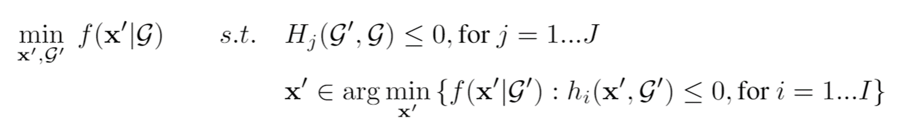
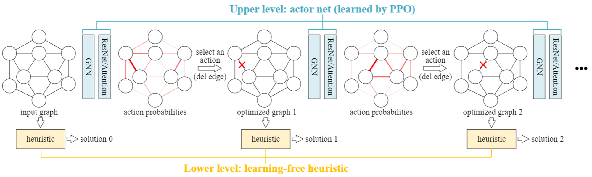
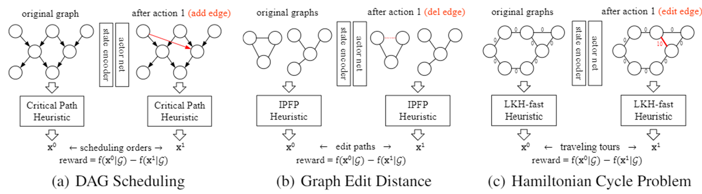

# PPO-BiHyb

This is the official implementation of our NeurIPS 2021 paper "A Bi-Level Framework for Learning to Solve Combinatorial Optimization on Graphs".
* [[paper]](https://arxiv.org/abs/2106.04927)

## A Brief introduction
In this paper, we propose a general deep learning pipeline for combinatorial optimization problems on graphs. The neural network is learned with Proximal Policy Optimization (**PPO**), under our **Bi**-Level **Hyb**rid optimization pipeline. Thus our method is called **PPO-BiHyb**. This section is aimed for a brief summary, and we recommend referring to our paper if you do not want to miss any details.

The family of existing machine learning for combinatorial optimization methods follow the following single-level pipeline:

and the neural network is designed to lean the mapping from the input graph G to the decision variable X. It brings challenges like the sparse reward issue in RL training, and it also makes the model design non-trivial to ensure that it has enough model capacity to learn such a mapping. 

In contrast, in this paper, we propose a bi-level optimization formulation:

where we introduce the optimized graph G'. The upper-level problem is to optimize G', and we design a PPO-based agent for this task; the lower-level optimization is to solve the optimization problem with G', and we resort to existing heuristic algorithms for this task.

The overview of our pipeline is summarized as follows


And Here is our implementation of the proposed framework on 3 problems:

* **DAG scheduling** problem models the computer resource scheduling problem in data centers, where the computer jobs are represented by Directed Acyclic Graphs (DAGs) and our aim is to minimize the makespan time to finish all jobs as soon as possible. This optimization problem is NP-hard.
* **Graph Edit Distance (GED)** problem is a popular graph distance metric, and it is inherently an NP-hard combinatorial optimization problem whose aim is to minimize the graph edit cost between two graphs.
* **Hamiltonian Cycle Problem (HCP)** is similar (but more difficult) to the famous [7 bridges problem by Euler](https://en.wikipedia.org/wiki/Seven_Bridges_of_K%C3%B6nigsberg): given a graph, decide whether exist a valid Hamiltonian cycle in this graph (i.e. a path that travels all nodes without visiting a node twice). This decision problem is NP-complete.

## Experiment Results

### DAG scheduling (objective & relative: smaller is better)
|                      | **TPC-H-50 (#nodes=467.2)** |           | **TPC-H-100 (#nodes=929.8)** |            | **TPC-H-150 (#nodes=1384.5)** |           |
| :------------------: | :-------------------------: | :-------: | :--------------------------: | :--------: | :---------------------------: | :-------: |
|                      |          objective          | relative  |          objective           |  relative  |           objective           | relative  |
|  shortest job first  |            12818            |   30.5%   |            19503             |   15.3%    |             27409             |   12.2%   |
|  tetris scheduling   |            12113            |   23.3%   |            18291             |    8.1%    |             25325             |   3.7%    |
|    critical path     |            9821             |   0.0%    |            16914             |    0.0%    |             24429             |   0.0%    |
|      PPO-Single      |            10578            |   7.7%    |            17282             |    2.2%    |             24822             |   1.6%    |
|     Random-BiHyb     |            9270             |   -5.6%   |            15580             |   -7.9%    |             22930             |   -6.1%   |
| **PPO-BiHyb (ours)** |          **8906**           | **-9.3%** |          **15193**           | **-10.2%** |           **22371**           | **-8.4%** |

### GED (objective & relative: smaller is better)
|                      | AIDS-20/30  (#nodes=22.6) |            | AIDS-30/50  (#nodes=37.9) |           | AIDS-50+ (#nodes=59.6) |            |
| -------------------- | ------------------------- | ------------------------- | ---------------------- | ---------- | --------- | ---------- |
|                      | objective                 | relative                  | objective              | relative   | objective | relative   |
| Hungarian            | 72.9                      | 94.9%                     | 153.4                  | 117.9%     | 225.6     | 121.4%     |
| RRWM                 | 72.1                      | 92.8%                     | 139.8                  | 98.6%      | 214.6     | 110.6%     |
| Hungarian-Search     | 44.6                      | 19.3%                     | 103.9                  | 47.6%      | 143.8     | 41.1%      |
| IPFP                 | 37.4                      | 0.0%                      | 70.4                   | 0.0%       | 101.9     | 0.0%       |
| PPO-Single           | 56.5                      | 51.1%                     | 110.0                  | 56.3%      | 183.9     | 80.5%      |
| Random-BiHyb         | 33.1                      | -11.5%                    | 66.0                   | -6.3%      | 82.4      | -19.1%     |
| **PPO-BiHyb (ours)** | **29.1**                  | **-22.2%**                | **61.1**               | **-13.2%** | **77.0**  | **-24.4%** |

### HCP (TSP objective: smaller is better, found cycles: larger is better)
|                      | FHCP-500/600  (#nodes=535.1) |              |
| -------------------- | ---------------------------- | ------------ |
|                      | TSP objective                | found cycles |
| Nearest Neighbor     | 79.6                         | 0%           |
| Farthest Insertion   | 133.0                        | 0%           |
| LKH3-fast            | 13.8                         | 0%           |
| LKH3-accu            | **6.3**                          | 20%          |
| PPO-Single           | 9.5                          | 0%           |
| Random-BiHyb         | 10.0                         | 0%           |
| **PPO-BiHyb (ours)** | 6.7                      | **25%**      |

## Environment set up

This code is developed and tested on Ubuntu 16.04 with Python 3.6.9, Pytorch 1.7.1, CUDA 10.1.

Install required pacakges:
```shell
export TORCH=1.7.0
export CUDA=cu101
pip install torch==1.7.1+${CUDA} torchvision==0.8.2+${CUDA} torchaudio===0.7.2 -f https://download.pytorch.org/whl/torch_stable.html
pip install --no-index --upgrade torch-scatter -f https://pytorch-geometric.com/whl/torch-${TORCH}+${CUDA}.html
pip install --no-index --upgrade torch-sparse -f https://pytorch-geometric.com/whl/torch-${TORCH}+${CUDA}.html
pip install --no-index --upgrade torch-spline-conv -f https://pytorch-geometric.com/whl/torch-${TORCH}+${CUDA}.html
pip install --upgrade torch-geometric
pip install tensorboard
pip install networkx==2.2
pip install ortools
pip install texttable
pip install tsplib95
pip install cython
```

Install SVN which is required when retriving the GED dataset:
```
sudo apt install subversion
```

Compile the A-star code which is required by the GED problem:
```
python3 setup.py build_ext --inplace
```

Install [LKH-3](http://webhotel4.ruc.dk/~keld/research/LKH-3/) which is required by the HCP experiment:
```
wget http://webhotel4.ruc.dk/~keld/research/LKH-3/LKH-3.0.6.tgz
tar xvfz LKH-3.0.6.tgz
cd LKH-3.0.6
make
```
And you should find an executable at ``./LKH-3.0.6/LKH``, which will be called by our code.

## Run Experiments
We provide the implementation of PPO-BiHyb and the single-level RL baseline PPO-Single used in our paper. To run evaluation from a pretrained model, replace ``train`` by ``eval`` in the following commands.

### DAG Scheduling
PPO-BiHyb:
```
python dag_ppo_bihyb_train.py --config ppo_bihyb_dag.yaml
```
PPO-Single:
```
python dag_ppo_single_train.py --config ppo_single_dag.yaml
```
To test different problem sizes, please modify this entry in the yaml file: ``num_init_dags: 50`` (to reproduce the results in our paper, please set 50/100/150)

### Graph Edit Distance (GED)
PPO-BiHyb:
```
python ged_ppo_bihyb_train.py --config ppo_bihyb_ged.yaml
```
PPO-Single:
```
python ged_ppo_single_train.py --config ppo_single_ged.yaml
```
To test different problem sizes, please modify this entry in the yaml file: ``dataset: AIDS-20-30`` (to reproduce the results in our paper, please set AIDS-20-30/AIDS-30-50/AIDS-50-100)

### Hamiltonian Cycle Problem (HCP)
PPO-BiHyb:
```
python hcp_ppo_bihyb_train.py --config ppo_bihyb_hcp.yaml
```
PPO-Single:
```
python hcp_ppo_single_train.py --config ppo_single_hcp.yaml
```

### Some Remarks
The yaml configs are set for the smallest sized problems by default. For PPO-Single, you may need to adjust the ``max_timesteps`` config for larger-sized problems to ensures that the RL agent can predict a valid solution.

## Pretrained models
We provide pretrained models for PPO-BiHyb on these three problems, which are stored in ``./pretrained``. To use your own parameters, please set the ``test_model_weight`` configuration in the yaml file.

## Citation and Credits
If you find our paper/code useful in your research, please citing
```
@inproceedings{wang2021bilevel,
    title={A Bi-Level Framework for Learning to Solve Combinatorial Optimization on Graphs}, 
    author={Runzhong Wang and Zhigang Hua and Gan Liu and Jiayi Zhang and Junchi Yan and Feng Qi and Shuang Yang and Jun Zhou and Xiaokang Yang},
    year={2021},
    booktitle={NeurIPS}
}
```

And we would like to give credits to the following online resources and thank their great work:
* [TPC](http://www.tpc.org/tpch/) (for our DAG scheduling dataset)
* [GEDLIB](https://github.com/dbblumenthal/gedlib) and [U.S. National Institutes of Health](https://wiki.nci.nih.gov/display/NCIDTPdata/AIDS+Antiviral+Screen+Data) (for our GED dataset)
* [FHCP challenge](https://sites.flinders.edu.au/flinders-hamiltonian-cycle-project/fhcp-challenge-set/) (for our HCP dataset)
* [LKH-3](http://webhotel4.ruc.dk/~keld/research/LKH-3/) (the powerful HCP/TSP heuristic)
